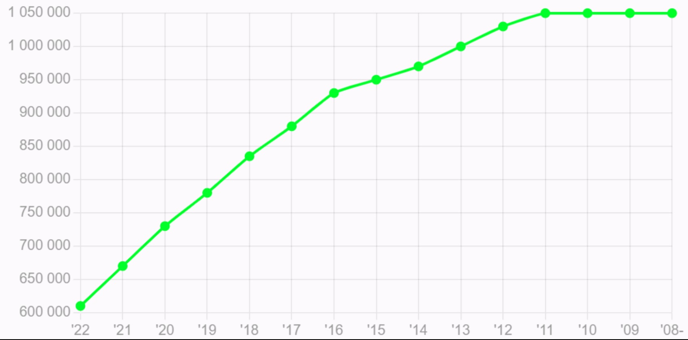

# Betingelser

> Høy inntekt er ikke en forutsetning for høy prestasjonsevne. Men vissheten om at en får en gode og rettferdige betingelser, bidrar til positiv energi som kommer både firmaet og den ansatte til gode. Det samme gjelder rettigheter og fordeler. Det sier seg sjøl at det skal være trygt og godt å være en 321er. I tillegg er det viktig for oss at alle skal føle at de har muligheten til å utvikle seg, lære noe nytt eller pusse på noe gammelt. Ja, og så gjør vi vårt beste for at 321 skal bidra til at verden er et fint sted å leve - vi vil hele tiden gjør vårt beste for klima, miljø og trivsel.

## Lønn

Hva 321ere tjener er ingen hemmelighet for noen - vi har åpen lønn. Vi har gjort det enkelt og baserer oss på Teknas lønnstatistikk. Mer presist så tar vi utgangspunkt i statistikken for IKT(data/IT) i privat sektor og tallene for øvre kvartil. Dermed er hva du tjener i utgangspunktet en funksjon av hvilken utdannelse du har og hvor lenge du har jobbet i bransjen. Unntak vil kunne forekomme, men da må også begrunnelsen være åpen og oppfattes som rettferdig av felleskapet.

Teknas årlige statistikk oppdateres i desember og lønnsjustering i 321 utføres da påfølgende januar måned. Lønn justeres ikke om du er i oppsigelsestid.

### Gjeldende lønnsgraf (2023)

Eksamensår i grafen er for en Mastergrad. For en Bachelor legges det til et år. Så hvis du var ferdig med en mastergrad i 2015 og har jobbet i bransjen siden det, vil din lønn bli 950 000,- Tilsvarende for en bachelor vil være 930 000,- (Eksamensår justert til 2016) </

## Bonus

Alle 321ere bidrar på hver sin måte mot felles mål, overskuddet skal derfor også deles. 20% av årlig overskudd deles likt fordelt på alle som har bidratt, uavhengig av ansiennitet og eierandeler. De som har vært ansatt bare deler av året får sin andel i henhold til antall måneder man har vært ansatt. Bonus på 20% er inklusiv arbeidsgiveravgift (som blir trukket i fra) og feriepenger (som blir utbetalt året etter).

## Rekrutteringsbonus

Vi ser hele tiden etter nye flinke folk som ønsker å bli en av oss. Alle 321ere har et medansvar for å markedsføre 321 og å tipse om gode kandidater. Vi gir 30 000,- i rekrutteringsbonus for tips som resulterer i en fast ansettelse. Det utbetales ikke feriepenger på denne type bonus.

## Medeierskap

Hos 321 eier vi aksjene selv. Alle 321ere skal kunne få gleden av gode resultater og selskapets utvikling. Nye ansatte får derfor tilbud om å kjøpe seg inn etter endt prøvetid. Vi eier alle samme type aksje, med like rettigheter i Generalforsamling og til utbytte.

## Sykelønn

Alle våre arbeidstagere er forsikret med sykeforsikring. Dette sikrer at vi ved eventuell sykemelding utover 16 dager får utbetalt differansen mellom hva NAV utbetaler og hva vi faktisk har i årslønn.
Ved eventuell sykdom utbetaler 321 lønn og får refusjon fra NAV og eventuelt forsikring.

