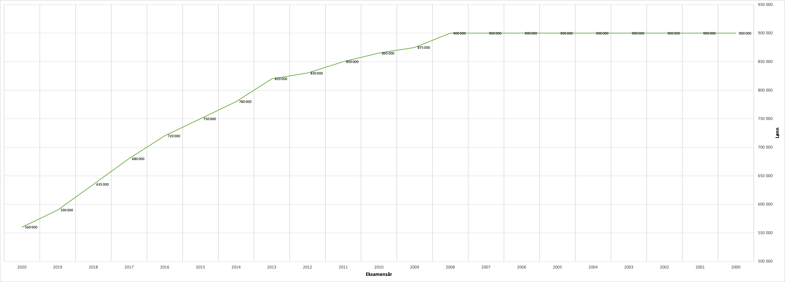
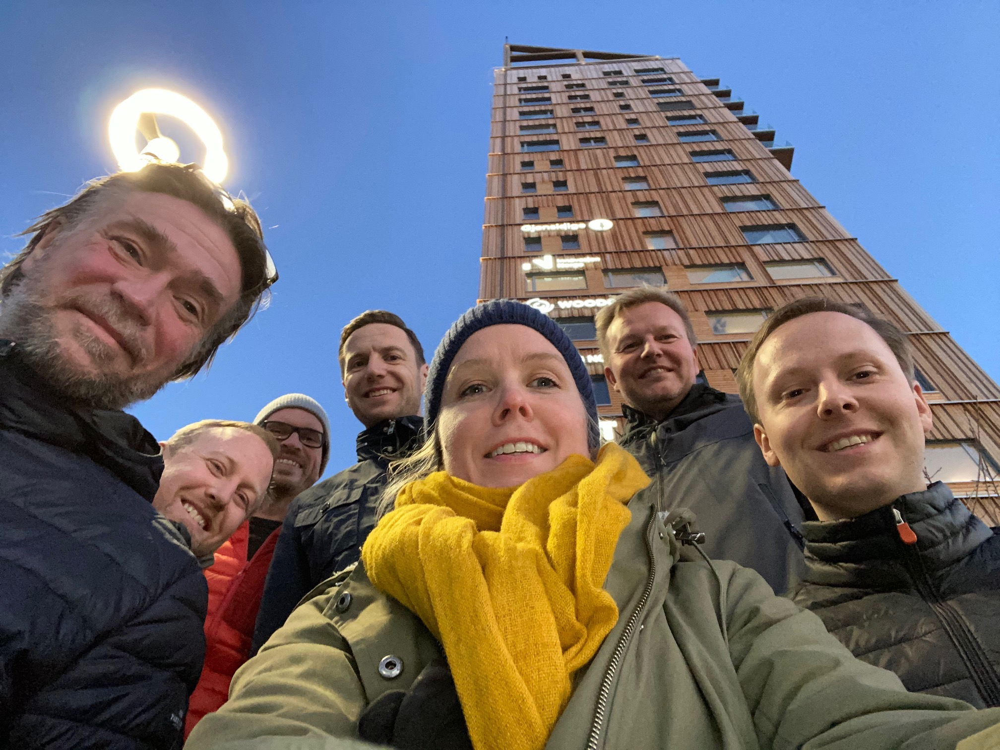

# Personalhåndbok for 321
Denne personalhåndboken prøver å besvare spørsmål en kan ha som ansatt i 321. Hvis noe er uklart eller mangelfullt spør gjerne på Slack.

Hvis du har innspill til endringer til denne håndboken så kan du lage en pullrequest [her](https://github.com/tretoen/handbook).

## Verdier
"Vi knytter modige personer sammen og skaper stolte øyeblikk". Hva mener vi egentlig med det? Vi mener de som startet 321 var modige som så muligheten, tok sats og hoppet. Like modige har Mari, Ole Fredrik, Ole Hjalmar og Morten vært. Alle snakker varmt om hvor fint de hadde det der de kom fra, men allikevel var de modige og kom til 321 for å bygge et nytt selskap med base på Hamar.

Vi blir stolte når vi tiltrekker oss gode folk, når vi lærer noe nytt og spennende av hverandre eller forbedrer bransjen vår. Vi blir dessuten minst like stolte sammen med kundene våre når vi i fellesskap lanserer noe nytt eller oppnår kundens mål.

### Åpen
Vi er et åpent og transparent selskap. Hos oss er det ingen lukkede dører. Det er full åpenhet på innkjøp, økonomi, lønn, forventet utvikling på lønnen til neste år, osv. På denne måten rydder vi vekk alle slike spørsmål, og kan fokusere på hvordan vi selv utvikler hver enkelt av oss, kundene og 321.

### Ærlig
De fleste selskaper og ansatte er ærlige. For oss i 321 mener vi dette er en viktig del av å være konsulent. En konsulent skal utfordre, og stille ærlige spørsmål. Vår erfaring er at ærlige (men hyggelig) tilbakemeldinger utvikler oss videre, men også at kundene verdsetter dette.

### Modig
Ærlighet krever mot. Når 321 er ærlige om oppdrag vi ikke er den rette til, risikerer vi å miste kunden. Men vi risikerer mer ved å late som vi er noe vi ikke er. Når vi i 321 setter oss høye mål er vi litt modige, men når vi gjør tiltak for å oppnå disse målene krever det ofte at vi er veldig modige. Et eksempel på dette er denne åpne personalhåndboka. Vi kan ikke påstå vi er åpne og transparente uten å dele denne informasjonen. Enkelt å vedta, krever litt mer mot å gjennomføre.

## Betingelser

Høy inntekt er ikke en forutsetning for høy prestasjonsevne. 
Men vissheten om at en får en gode og rettferdige betingelser, bidrar til positiv energi som kommer både firmaet og den ansatte til gode.

### Lønn

Hva folk tjener i 321 er ingen hemmelighet, vi har åpen lønn. Vi har også gjort det enkelt og baserer oss på Teknas lønnstatistikk. 
Mer presist så baserer vi oss på statistikken for IKT-gjennomsnitt i privat sektor. 
Dermed er hva du tjener i utgangspunktet en funksjon av hvilken utdannelse du har og hvor lenge du har jobbet i bransjen. 
Unntak vil kunne forekomme, men da må også begrunnelsen være åpen og oppfattes som rettferdig av felleskapet.

Teknas årlige statistikk oppdateres i desember og lønnsjustering i 321 utføres da påfølgende januar måned.

#### Gjeldende lønnsgraf 321

Eksamensår i grafen er for en mastergrad, for en bachelor legges det til et år. 
Så hvis du var ferdig med en mastergrad i 2015 og har jobbet i bransjen siden det, vil din lønn bli 750 000,- 
Tilsvarende for en bachelor vil være 720 000,- (Eksamensår justert til 2016)

### Rekrutteringsbonus
321 ser hele tiden etter gode folk som ønsker å bli en av oss. Alle har et medansvar for å markedsføre 321 og å tipse om gode kandidater. Vi gir 30 000,- i rekrutteringsbonus for tips som ender opp med fast ansettelse.

Det utbetales ikke feriepenger på denne type bonus.

### Ansattaksjer

Vi har gründeraksjer eller såkalte A-aksjer og fordelingen per nå er slik:

- Lars Ingar 16,82%
- Kim 16,82%
- Anders 16,82%
- Ole Hjalmar 11%
- Heidi 13,82%
- Mari 10%
- Morten 10%
- Ola 4,72%

Men vår intensjon er at alle ansatte som ønsker det skal kunne kjøpe aksjer i 321. På den måten kan alle få glede av gode resultater og selskapets verdiøkning. 
Vi jobber derfor nå med å opprette en egen aksjeklasse, såkalt B-aksje, som vi oppretter ved emisjon. Vårt ansattaksjeprogram vil bli klart i løpet første kvartal i 2021.

### Forsikringer

#### Behandlingsforsikring

Behandlingsforsikring som dekker følgende (med forbehold om endringer hos Gjensidige):

- Røntgen og bildediagnostikk
- Utredning og behandling hos legespesialist
- Operasjon
- Etterkontroll
- Rehabilitering
- Ny vurdering hos annen lege (second opinion)
- Psykologisk førstehjelp
- Behandling hos psykolog - 10 behandlinger
- Behandling av rus- og spilleavhengighet
- Fysikalsk behandling - 12 behandlinger
- Online Videolege

#### Sykelønn

Vi har forsikret alle våre arbeidstagere med sykeforsikring. Denne sikrer at vi ved eventuell sykemelding utover 14 dager får utbetalt differansen mellom hva NAV utbetaler og hva vi faktisk har i årslønn. NAV utbetaler 6G (599.000).

Men dette betyr noe viktig: alle ansatte må fylle ut Helseerklæring innen fristen for å få denne forsikringen. Dette følges opp av 321 som en del av onboarding i tillegg til den ansatte selv.

Ved eventuell sykdom utbetaler 321 lønn og får refusjon fra NAV og eventuelt forsikring. Dekning av sykepenger mellom NAV (6G) og faktisk lønn dekkes kun dersom arbeidstaker er dekket av forssikringsselsakpet.

#### Yrkesskade

- Lovbestemt yrkesskade
- Utvidet yrkesskade
- Lovbestemt yrkessykdom

### Utlegg bredbånd

Bredbånd dekkes med inntil 600kr per måned. Utlegg skal registreres per måned eller kvartal, og summen som skal refunderes er 600kr per måned, selv om faktura eventuelt er høyere. Da sparer selskapet tid på å gå gjennom når hver ansatt når grensen på 600kr * 12.

### Betalt fravær

Den tiden vi er på jobb brukes i hovedsak hos kunde eller på kompetanseheving. Men av og til har alle behov for tannlegetime eller lignende. For å slippe å jobbe inn slike timer er det lov å føre ufakturerbar tid på tiden du bruker til følgende:

- Tannlege
- Fysioterapi
- Legetime

### Ferie/fridager

I tillegg til de vanlige 5 uker med ferie har vi fri julaften og nyttårsaften.

### Pensjonssparing

Selskapet har pensjonssparing hos Gjensidige for alle ansatte. Vi innbetaler 5% fra første krone og opp til 12G. Eksempelvis med en årslønn på kr700.000 blir din årlige pensjon på kr 35.000.

Det er åpnet opp for at de ansatte kan samle sine (tidligere) pensjonsavtaler hos Gjensidige. Hver ansatt må kontakte Gjensidige om dette.

### Foreldrepermisjon

Det å bli forelder er en fantastisk opplevelse og vi unner alle å ta en velfortjent foreldrepermisjon. 
Tiden du er i permisjon vil ikke gå utover din ansiennitet i selskapet. 
For at 321 skal betale mellomlegget mellom utbetaling fra Nav og full lønn må du ha jobbet i 321 i minimum ett år før du går ut i foreldrepermisjon.

I forbindelse med fødsel har far, medmor eller den som bistår mor under graviditeten rett til to uker permisjon. Permisjonen skal tas ut innenfor et tidsrom på 2 uker før til 2 uker etter fødsel. Permisjonen kan deles opp, og det er helt i orden at man benytter for eksempel 1 til 2 dager knyttet til selve fødselen, gjenopptar arbeidet og så tar resten av permisjonen når mor og barn kommer hjem fra sykehuset. 321 utbetaler full lønn for disse 2 ukene.

## Fag

Kunnskap er det produktet vi selger og derfor er det svært viktig at alle som jobber hos oss er oppdatert. Som selskap trenger vi å vite hva som finnes der ute; hva er trender, hva trenger kundene våre og hva er vikig for oss. Det er viktig at du har en egen motivasjon til å lære deg nye ting selv og setter av tid til det, men vi legger også tilrette for at man kan få prioritert dette i en hektisk hverdag.

### 321-dag

En gang i måneden møtes hele gjengen for faglig samvær. Vi bruker hele dagen sammen og avslutter ofte med å gå ut å spise på en av Hamars fantastiske spisesteder.
Hensikten med dagen er at vi møtes, blir godt kjent med hverandre og at vi lærer oss nye ting. En typisk 321-dag er delt i to hvor vi i første halvdel deler med hverandre i form av foredrag og andre halvdel er egenstudier.

### Generell kompetanseutvikling

Vi er alle forskjellige og har forskjellige preferanser og måter å lære på. Noen foretrekker å lese en bok og teste ut ting selv, andre ønsker å følge et kurs eller reise på konferanser. Vi har tillit til at du som ansatt tar avgjørelser som er til det beste for selskapet og derfor har vi ikke et bestemt budsjett som styrer hvor mye eller hva du kan dra på. Er det akkurat den konferansen i London som du mener er mest riktig for deg og 321 så drar du dit.

## Rutiner
Vi i 321 er ikke veldig formelle, og vil hele tiden jobbe for å ha så få systemer og rutiner som mulig.

### Utstyr
Vi har stor tro på hver ansatt sin vurderingsevne. Om du mener det er til det beste for 321 med et headset, ny pc, eller en lisens, så stoler vi på at du tar er riktig valg. Det er ingen beløpsgrenser for kjøp av pc/mobil, men vi forventer også her at du vurderer hva som er det beste for selskapet. Sjekk gjerne hva de andre bruker om du er i tvil. Du står naturligvis fritt til å velge Windows, Linux eller OS X.

Alle kjøp registreres av den anatte i felles oversikt som alle har tilgang til. Utstyr og lisenser betales av 321.

Eksempel på gode vurderinger:
- Mari sin helt nydelige 49" skjerm.
- Morten sin Macbook Pro 16".
- Kim sin Lenovo

### Internsystemer

#### Slack
Vi bruker [Slack](https://slack.com/) til kommunikasjon internt. Her er alle kanaler åpne, utenom eventuelle temaer som er taushetsbelagt.

#### CV Partner
Alle ansatte har sine CVer i [CV Partner](https://321.cvpartner.com) og har ansvar for at CVen er oppdatert.

#### Tripletex
Timeføring gjøres i [Tripletex](https://www.tripletex.no). Timeføring skal gjøres ukentlig, og være ferdig senest påfølgende mandag formiddag. Her finner hver ansatt oversikt over mertid, ferie og kan registerer eventuelle utlegg.
Det føres 37,5 timer på en normal arbeidsuke, det utgjør 7,5 timer per dag fraregnet lunch. 

Det er viktig for oss at alle ansatte har en god balanse mellom jobb og fritid. For noen betyr dette muligheten til å jobbe seg opp plusstid som kan avspaseres senere.
Alle i 321 står fritt til dette så lenge arbeidstid er innenfor arbeidsmiljøloven sine krav og pluss- eller minustid ikke overstiger 40 timer.

For å sikre god balanse mellom jobb og fritid ønsker vi ikke å jobbe overtid, men unntaksvis kan det være kundebehov som krever det. 
Overtid skal alltid avtales i forkant, og gir et overtidstillegg på 40%.

